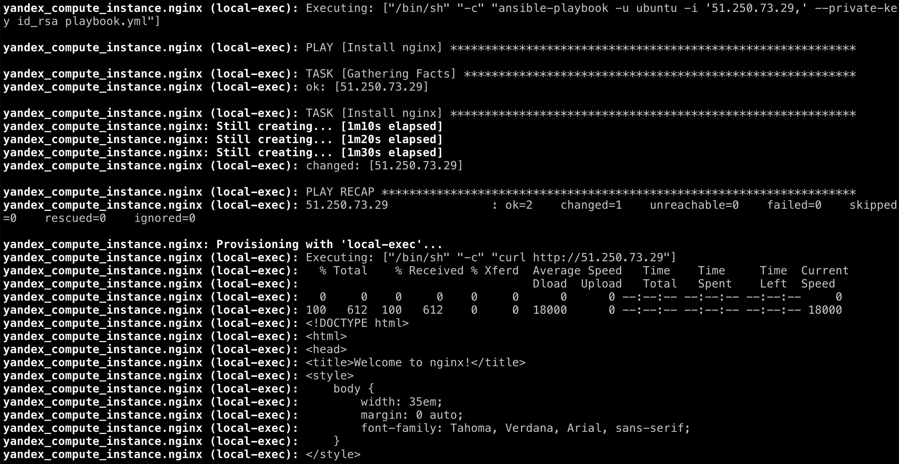

## Создать ВМ

```bash
terraform apply
```

## Удалить ВМ

```bash
terraform destroy
```

## Скринтшот



## Полезные ссылки

[Язык HCL](https://github.com/hashicorp/hcl/blob/main/hclsyntax/spec.md)  
[Provisioners](https://github.com/hashicorp/terraform/tree/main/website/docs/language/resources/provisioners)  
[Ansible/become](https://webhamster.ru/mytetrashare/index/mtb0/15749415036y9pxcsihd)  
[Terraform Language Documentation](https://developer.hashicorp.com/terraform/language)  
