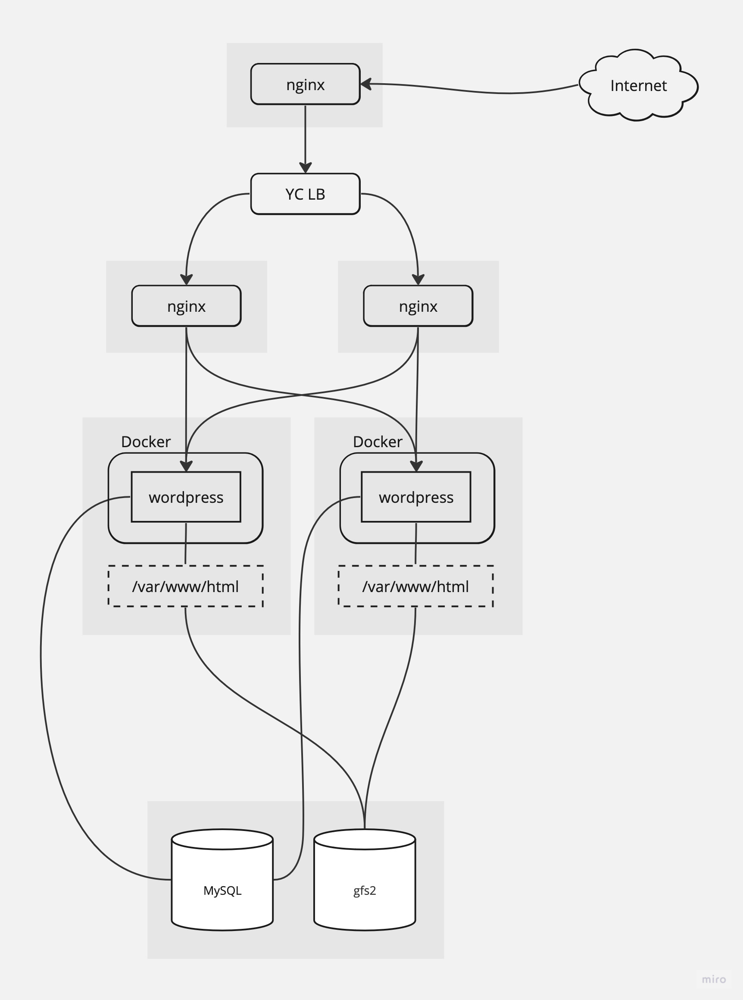

# Схема



- 502 Bad Gateway в течении нескольких секунд при nginx/wordpress switchover, но потом восстанавливается.
- Сессия не рвется, т.к. видимо wordpress сбрасывает сессию на диск, а /var/www/html под gfs2
- Можно оставлять рабочим только wordpress-1, загружать картинку, потом делать switchover на wordpress-2 и картинка на месте (потому что gfs2).

```
$ ./wrk -t12 -c400 -d30s http://51.250.91.244/
Running 30s test @ http://51.250.91.244/
  12 threads and 400 connections
  Thread Stats   Avg      Stdev     Max   +/- Stdev
    Latency     1.13s   527.19ms   1.98s    61.54%
    Req/Sec     5.24      7.43    60.00     91.38%
  530 requests in 30.06s, 42.75MB read
  Socket errors: connect 0, read 342364, write 0, timeout 491
Requests/sec:     17.63
Transfer/sec:      1.42MB
```
```
$ ./wrk -t12 -c400 -d30s http://backend-1.ru-central1.internal
Running 30s test @ http://backend-1.ru-central1.internal
  12 threads and 400 connections
  Thread Stats   Avg      Stdev     Max   +/- Stdev
    Latency   586.21ms  314.65ms   1.63s    80.00%
    Req/Sec     9.63     10.53    60.00     91.57%
  538 requests in 30.05s, 43.56MB read
  Socket errors: connect 0, read 1, write 0, timeout 443
Requests/sec:     17.90
Transfer/sec:      1.45MB
```

# Домашнее задание

Настройка конфигурации веб приложения под высокую нагрузку

# Цель:

Terraform (или vagrant) и ansible роль для развертывания серверов веб приложения под высокую нагрузку и отказоустойчивость

В работе должны применяться:

- keepalived, (в случае использовать vagrant и virtualbox), load balancer от yandex в случае использования яндекс клауд
- nginx,
- uwsgi/unicorn/php-fpm
- некластеризованная бд mysql/mongodb/postgres/redis

# Описание/Пошаговая инструкция выполнения домашнего задания:

- Создать несколько инстансов с помощью терраформ (2 nginx, 2 backend, 1 db)
- Развернуть nginx и keepalived на серверах nginx при помощи ansible
- Развернуть бэкенд способный работать по uwsgi/unicorn/php-fpm и базой. (Можно взять что нибудь из Django) при помощи ansible.
- Развернуть gfs2 для бэкенд серверах, для хранения статики
- Развернуть бд для работы бэкенда при помощи ansbile
- Проверить отказоустойчивость системы при выходе из строя серверов backend/nginx

# Эти требования удалили

# Должна быть реализована:

- отказоустойчивость бэкенд и nginx серверов
- отказоустойчивость сессий
- фэйловер без потери статического контента

Должны быть реализованы ansible скрипты с тюнингом:
- параметров sysctl
- лимитов
- настроек nginx
- включением пулов соединений

# План

- [ ] посмотреть про nginx
- [ ] посмотреть про keepalived
- [ ] посмотреть про haproxy
- [ ] посмотреть про envoy
- [ ] посмотреть про traefik
- [ ] развернуть nginx и keeplived на серверах nginx при помощи ansible

# Заметки

- VRRP это про отказоустойчивость, HAProxy про балансировку
- файл конфигурации keepalived /etc/keepalived/keepalived.conf
- systemctl enable start keepalived

[Устройство сети в Yandex Cloud](https://cloud.yandex.ru/docs/overview/concepts/network)    
[Deckhouse](https://deckhouse.ru/documentation/v1/modules/450-keepalived/examples.html)    
[Резервирование маршрутизатора с использованием протокола VRRP](https://procloud.ru/blog/cases/rezervirovanie-marshrutizatora-s-ispolzovaniem-protokola-vrrp/)    
[репо с курса](https://github.com/Nickmob/vagrant-ansible-haproxy-keepalived)    
[Ansible: Execute task only when a tag is specified](https://serverfault.com/questions/623634/ansible-execute-task-only-when-a-tag-is-specified)  
https://www.project-open.com/en/howto-postgresql-port-secure-remote-access  
https://info.gosuslugi.ru/articles/%D0%A0%D0%B0%D0%B7%D0%BC%D0%B5%D1%89%D0%B5%D0%BD%D0%B8%D0%B5_%D0%A1%D0%A3%D0%91%D0%94_PostgreSQL_%D0%BD%D0%B0_%D0%BE%D1%82%D0%B4%D0%B5%D0%BB%D1%8C%D0%BD%D0%BE%D0%BC_%D0%BE%D1%82_%D0%B0%D0%B4%D0%B0%D0%BF%D1%82%D0%B5%D1%80%D0%B0_CentOS_%D1%81%D0%B5%D1%80%D0%B2%D0%B5%D1%80%D0%B5/  
https://computingforgeeks.com/how-to-install-postgresql-on-centos-rhel-7/  
https://hub.docker.com/_/wordpress  
https://docs.docker.com/network/network-tutorial-host/  
https://docs.docker.com/config/containers/start-containers-automatically/  
https://www.techtransit.org/install-mysql-database-server-through-ansible-playbook/  
https://copyprogramming.com/howto/install-and-configure-mysql-using-ansible  
https://www.digitalocean.com/community/tutorials/how-to-install-wordpress-on-centos-7  
https://github.com/geerlingguy/ansible-role-mysql  
https://docs.ansible.com/ansible/latest/playbook_guide/playbooks_reuse_roles.html  
https://docs.ansible.com/ansible/latest/reference_appendices/config.html  
https://askubuntu.com/questions/883404/pip-install-is-not-installing-executables-in-usr-local-bin  
https://stackoverflow.com/questions/65225803/ansible-ec2-no-such-file-or-directory-bssh-bssh  
https://stackoverflow.com/questions/1559955/host-xxx-xx-xxx-xxx-is-not-allowed-to-connect-to-this-mysql-server  
https://docs.docker.com/config/daemon/systemd/  
https://docs.docker.com/engine/install/centos/#install-using-the-repository  
[yandex lb address issue](https://github.com/yandex-cloud/terraform-provider-yandex/issues/114)  
[lb concepts](https://cloud.yandex.ru/docs/network-load-balancer/concepts/listener)  
[lb](https://terraform-provider.yandexcloud.net//Resources/lb_network_load_balancer)  
[listener](https://cloud.yandex.com/en-ru/docs/network-load-balancer/concepts/listener)  
https://www.digitalocean.com/community/tutorials/how-to-install-wordpress-with-docker-compose-ru  
https://github.com/docker-library/wordpress/pull/142  
https://github.com/docker-library/wordpress/blob/master/wp-config-docker.php  
https://developer.wordpress.org/apis/wp-config-php/  
https://nginx.org/en/docs/http/ngx_http_upstream_module.html  
https://jodies.de/ipcalc?host=192.168.0.0&mask1=24&mask2=  
https://www.digitalocean.com/community/tutorials/nginx-access-logs-error-logs  
https://docs.nginx.com/nginx/admin-guide/load-balancer/http-load-balancer/  
https://www.cyberciti.biz/faq/unix-linux-execute-command-using-ssh/  
https://subscription.packtpub.com/book/cloud-and-networking/9781800207554/2/ch02lvl1sec23/generating-passwords-with-terraform  
https://www.nginx.com/resources/wiki/start/topics/examples/forwarded/  
https://docs.nginx.com/nginx/admin-guide/monitoring/logging/#setting-up-the-access-log  
https://easyengine.io/tutorials/nginx/forwarding-visitors-real-ip/  
https://easyengine.io/tutorials/nginx/forwarding-visitors-real-ip/  
https://linuxize.com/post/bash-case-statement/  
https://www.digitalocean.com/community/tutorials/how-to-install-nginx-on-centos-7  
[Setting the User in a Docker Container From the Host](https://www.baeldung.com/linux/docker-set-user-container-host)  

GOOS=linux GOARCH=amd64 go build -o app main.go
