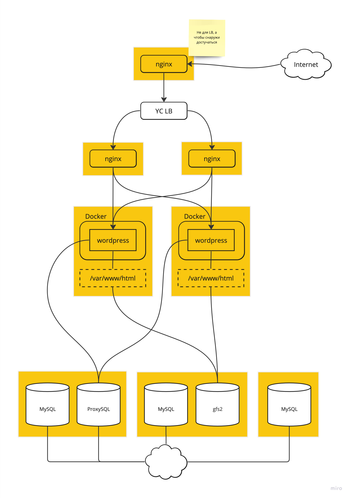

# Схема

# Домашнее задание

Развернуть InnoDB или PXC кластер

# Цель:

Перевести базу веб-проекта на один из вариантов кластера MySQL:
- Percona XtraDB Cluster
- или InnoDB Cluster.

# Описание/Пошаговая инструкция выполнения домашнего задания:

- Разворачиваем отказоустойчивый кластер MySQL (PXC || Innodb) на ВМ или в докере любым способом
- Создаем внутри кластера вашу БД для проекта

# Лекция

- mysql innodb cluster
- percona xtradb cluster (pxc)
