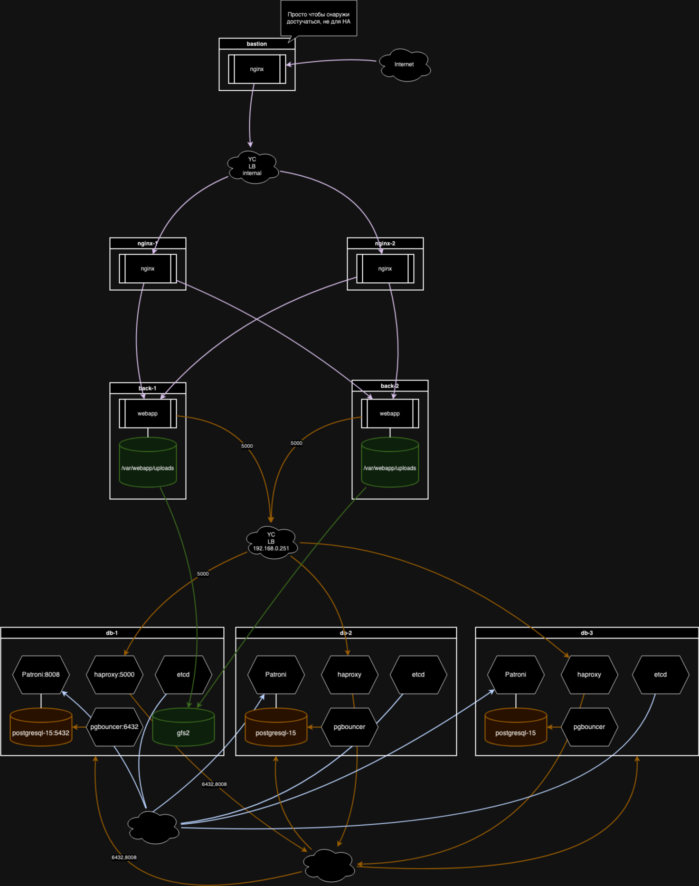

# Схема

# Домашнее задание

Реализация кластера postgreSQL с помощью patroni

# Цель:

Перевести БД веб проекта на кластер postgreSQL с ипользованием patroni, etcd/consul/zookeeper и haproxy/pgbouncer

# Описание/Пошаговая инструкция выполнения домашнего задания

Перевести БД веб проекта на кластер postgreSQL с ипользованием patroni, etcd/consul/zookeeper и haproxy/pgbouncer.

# Порядок запуска

- pg_install.sh
- wordpress_install.sh
- nginx_install.sh
- gfs2_install.sh
