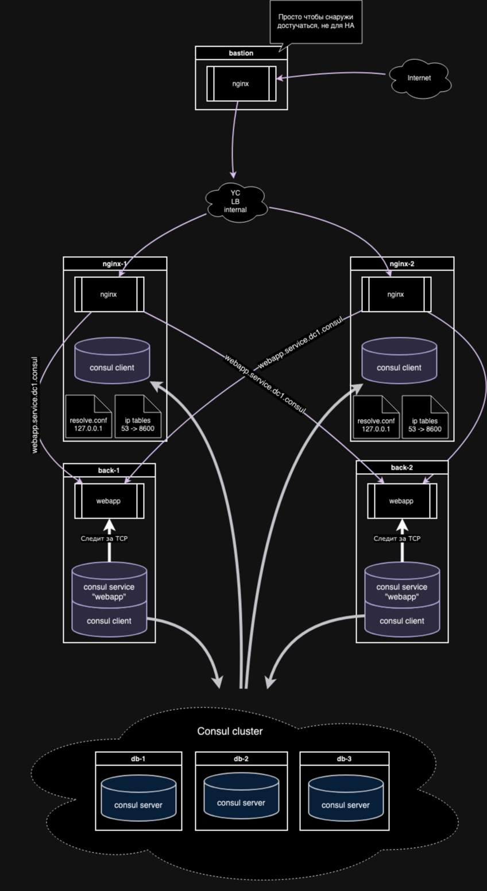

# Решение

- Кластер из трех Consul серверов.
- На двух backend Consul client-ы и определен Consul service "webapp".
- На двух nginx также Consul client-ы.
- Nginx перенаправляет запрос в webapp.service.dc1.consul
- 127.0.0.1 указан как первый resolver в /etc/resolve.conf
- iptables перенаправляет 127.0.0.1:53 в 127.0.0.1:8600



# Домашнее задание

Consul cluster для service discovery и DNS

# Цель:

Реализовать consul cluster который выдает доменное имя для веб портала с прошлой ДЗ.  
Плавающий IP заменить на балансировку через DNS.  
В случае умирание одного из веб серверов IP должен убираться из DNS.  

# Описание/Пошаговая инструкция выполнения домашнего задания:

- Реализовать consul cluster который выдает доменное имя для веб портала с прошлой ДЗ.
- Плавающий IP заменить на балансировку через DNS.
- В случае умирание одного из веб серверов IP должен убираться из DNS.

# Install

- tf validate
- tf apply
- ./gfs2_install.sh
- ./webapp_install.sh
- ./nginx_install.sh

скопировать ansible_ssh_common_args из inventory

```bash
cp /home/otus/otus/dz8/id_rsa /home/otus/postgresql_cluster
cd /home/otus/postgresql_cluster
vim /home/otus/postgresql_cluster/inventory
ansible all -m ping
ansible-playbook deploy_pgcluster.yml
```

# Полезные ссылки

- https://docs.ansible.com/ansible/latest/collections/ansible/builtin/iptables_module.html
- https://nginx.org/en/docs/http/ngx_http_upstream_module.html?&_ga=2.3260528.1767852346.1704666626-1862778094.1704666626#resolver
- https://docs.nginx.com/nginx/admin-guide/load-balancer/http-load-balancer/
- https://stackoverflow.com/questions/49641685/nginx-resolver-dns
- https://developer-old.gnome.org/NetworkManager/stable/NetworkManager.conf.html
- https://unix.stackexchange.com/questions/470408/how-do-i-specify-the-order-that-network-manager-populates-etc-resolv-conf
- https://developer-old.gnome.org/NetworkManager/stable/nm-settings-nmcli.html
- https://www.digitalocean.com/community/tutorials/how-to-list-and-delete-iptables-firewall-rules
- https://andydote.co.uk/2019/09/24/consul-ubuntu-dns-revisited/
- https://developer.hashicorp.com/consul/tutorials/networking/dns-forwarding#iptables-setup
- https://devilbox.readthedocs.io/en/latest/howto/dns/add-custom-dns-server-on-linux.html
- https://serverfault.com/questions/810636/how-to-manage-dns-in-networkmanager-via-console-nmcli
- https://stackoverflow.com/questions/55304126/consul-bootstrap-expect-value
- https://www.dmosk.ru/miniinstruktions.php?mini=consul-cluster-ubuntu
- https://developer.hashicorp.com/consul/tutorials/docker/docker-compose-datacenter
- https://github.com/hashicorp/consul/tree/v1.17.1
- https://support.hashicorp.com/hc/en-us/articles/1500011608961-Checking-Consul-Network-Connectivity
- https://stackoverflow.com/questions/29537684/add-quotes-to-elemens-of-the-list-in-jinja2-ansible
- https://www.educative.io/answers/how-to-join-a-list-of-strings-in-ansible
- https://stackoverflow.com/questions/40696130/how-to-remove-or-exclude-an-item-in-an-ansible-template-list
- https://docs.ansible.com/ansible/latest/reference_appendices/special_variables.html
- https://docs.ansible.com/ansible/latest/playbook_guide/complex_data_manipulation.html
- https://developer.hashicorp.com/consul/docs/install/glossary
- https://developer.hashicorp.com/consul/docs/agent/config/cli-flags#_bootstrap_expect

```
sudo iptables -t nat -A PREROUTING -p udp -m udp --dport 53 -j REDIRECT --to-ports 8600
sudo iptables -t nat -A PREROUTING -p tcp -m tcp --dport 53 -j REDIRECT --to-ports 8600
sudo iptables -t nat -A OUTPUT -d localhost -p udp -m udp --dport 53 -j REDIRECT --to-ports 8600
sudo iptables -t nat -A OUTPUT -d localhost -p tcp -m tcp --dport 53 -j REDIRECT --to-ports 8600
```